# Polyglot Codebase Knowledge Graph

> Generated offline by **readmenator**. Supports C, C++, Python, Go, Rust, JS/TS, Java, C#, Shell, PHP, Dart, GDScript, Nim, ASM.
> No LLMs. No tokens. Pure static analysis.

**Total Files Parsed:** 1 | **Total Symbols Extracted:** 8 | **Total Imports:** 8

## Structural Knowledge Map

```mermaid
graph TD
    classDef mod fill:#1e1e1e,stroke:#ff6666,stroke-width:2px,color:#fff;
    classDef cls fill:#2d2d2d,stroke:#4ec9b0,stroke-width:2px,color:#fff;
    classDef fn fill:#333,stroke:#dcdcaa,stroke-width:1px,color:#dcdcaa;
    classDef ext fill:#111,stroke:#666,stroke-dasharray: 5 5,color:#aaa;
    tty_over_http_py["tty_over_http.py (py)"]
    class tty_over_http_py mod;
    tty_over_http_py_AllTheReads["AllTheReads"]
    class tty_over_http_py_AllTheReads cls;
    tty_over_http_py --> tty_over_http_py_AllTheReads
    tty_over_http_py_RunCmd["RunCmd"]
    class tty_over_http_py_RunCmd fn;
    tty_over_http_py --> tty_over_http_py_RunCmd
    tty_over_http_py_WriteCmd["WriteCmd"]
    class tty_over_http_py_WriteCmd fn;
    tty_over_http_py --> tty_over_http_py_WriteCmd
    tty_over_http_py_ReadCmd["ReadCmd"]
    class tty_over_http_py_ReadCmd fn;
    tty_over_http_py --> tty_over_http_py_ReadCmd
    tty_over_http_py_SetupShell["SetupShell"]
    class tty_over_http_py_SetupShell fn;
    tty_over_http_py --> tty_over_http_py_SetupShell
    ext_requests["requests"]
    class ext_requests ext;
    tty_over_http_py -.->|imports| ext_requests
    ext_time["time"]
    class ext_time ext;
    tty_over_http_py -.->|imports| ext_time
    ext_threading["threading"]
    class ext_threading ext;
    tty_over_http_py -.->|imports| ext_threading
    ext_pdb["pdb"]
    class ext_pdb ext;
    tty_over_http_py -.->|imports| ext_pdb
    ext_signal["signal"]
    class ext_signal ext;
    tty_over_http_py -.->|imports| ext_signal
    ext_sys["sys"]
    class ext_sys ext;
    tty_over_http_py -.->|imports| ext_sys
    ext_base64["base64"]
    class ext_base64 ext;
    tty_over_http_py -.->|imports| ext_base64
    ext_random["random"]
    class ext_random ext;
    tty_over_http_py -.->|imports| ext_random
```

---

## Architecture Reference

### PY (1 files)

#### `tty_over_http.py`
**Path:** `tty_over_http.py`

**Classs:**
- `AllTheReads` (line 7)

**Functions:**
- `RunCmd` (line 24)
- `WriteCmd` (line 33)
- `ReadCmd` (line 42)
- `SetupShell` (line 47)
- `sig_handler` (line 66)
- `__init__` (line 8)
- `run` (line 14)
