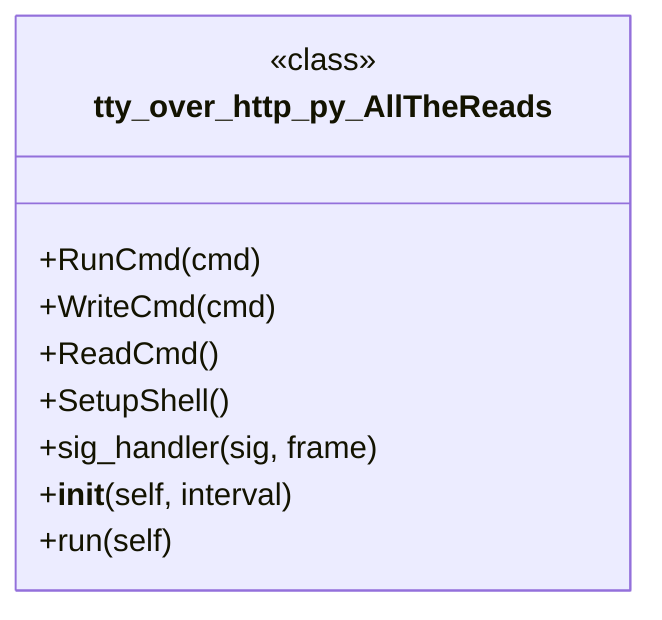

# Polyglot Codebase Knowledge Graph

> Generated offline by **readmenator**. 1 files, 8 symbols, 8 imports. Supports C, C++, Python, Go, Rust, JS/TS, Java, C#, Shell, PHP, Dart, GDScript, Nim, ASM, Ruby, Swift, Kotlin, Scala, Lua, Elixir.
> No LLMs. No tokens. Pure static analysis. See more [here](https://github.com/grisuno/ReadMenator)

**Start here:** Statistics Dashboard for scope, God Nodes for blast radius, Architecture Reference for per-file API. Agents: prefer `readmenator-agent/INDEX.md` + `SYMBOLS.md`.

**Wiki:** prefer `readmenator-wiki/index.md` for progressive disclosure: one synthesis page per community, `connections.json` with EXTRACTED vs INFERRED confidence, `queries.md` log, `REPORT.md` audit.

**Confidence:** EXTRACTED = parsed from source, INFERRED = heuristic bridge, AMBIGUOUS = reported, never hidden. See `readmenator-wiki/REPORT.md`.

**Total Files Parsed:** 1 | **Total Symbols Extracted:** 8 | **Total Imports:** 8

<!-- ranking_model: v1.0 | weights: {ppr:0.45,auth:0.2,test:0.15,doc:0.1,fresh:0.1} | alpha:0.85 | commit:05a4468 | date:2026-07-18 -->


## Table of Contents

1. [Statistics Dashboard](#statistics-dashboard)
2. [Architectural Layers](#architectural-layers)
3. [Ranked Context](#ranked-context)
4. [God Nodes](#god-nodes)
5. [Suggested Questions](#suggested-questions)
6. [Taint Propagation Map](#taint-propagation-map)
7. [Hotspot Analysis](#hotspot-analysis)
8. [Change Impact Analysis](#change-impact-analysis)
9. [Suggested Linting Rules](#suggested-linting-rules)
10. [Orphans](#orphans)
11. [Query Recipes](#query-recipes)
12. [Structural Knowledge Map](#structural-knowledge-map)
13. [UML Class Diagram](#uml-class-diagram)
14. [Code Property Graph](#code-property-graph)
15. [Architecture Reference](#architecture-reference)
    - [PY (1 files)](#py-1-files)

---

## Statistics Dashboard

| Metric | Value |
|--------|-------|
| Total Files | 1 |
| Total Symbols | 8 |
| Total Imports | 8 |
| Call Edges | 24 |
| Inheritance Edges | 1 |
| Languages | 1 |
| Avg Symbols/File | 8.0 |
| Avg Imports/File | 8.0 |

### Top Files by Import Count (Fan-Out)

| File | Imports | Symbols | Language |
|------|---------|---------|----------|
| `tty_over_http.py` | 8 | 8 | py |

---

## Architectural Layers

Auto-detected from path patterns, naming conventions, and imported frameworks.

| Layer | Files |
|-------|-------|
| presentation | 1 |

### presentation

- `tty_over_http.py` (py, 8 symbols)

---

## Ranked Context

Files ranked by composite score for the current query context. The ranking combines Personalized PageRank (query relevance), global authority, test coverage, documentation coverage, and code freshness. Model: v1.0.

| Rank | File | Composite | PPR | Authority | Test | Doc |
|------|------|-----------|-----|-----------|------|-----|
| 1 | `tty_over_http.py` | 0.0000 | 0.0000 | 0.0000 | 0.00 | 0.00 |

---

## God Nodes

Most architecturally central files ranked by combined import/export degree and symbol richness.

| File | Score | Connections | PageRank |
|------|-------|-------------|----------|
| `tty_over_http.py` | 0.8 | | 0.0000 |

---

## Suggested Questions

Auto-generated exploration prompts based on graph structure:

- What does tty_over_http.py depend on, and what depends on it? (0 connections)
- What is AllTheReads in tty_over_http.py and how is it used?
- What is the overall architecture of this codebase?

---

## Taint Propagation Map

Taint analysis traces how dangerous imports propagate through the codebase via transitive dependencies. Source files import dangerous modules directly; sink files receive the danger indirectly.

**Taint Sources:** 1 | **Taint Sinks:** 1 | **Propagation Paths:** 1

- `tty_over_http.py` imports `requests` (0 hop to `tty_over_http.py`) [medium]
  Path: tty_over_http.py

---

## Hotspot Analysis

Files ranked by combined complexity (symbol count) and centrality (connection count). High-scoring files are architecturally critical and may need refactoring attention.

| File | Complexity | Centrality | Combined | Symbols | Connections |
|------|-----------|------------|----------|---------|-------------|
| `tty_over_http.py` | 1.000 | 1.000 | 1.000 | 8 | 8 |

---

## Change Impact Analysis

Files sorted by how many other files would be affected if they changed. High-impact files should be changed with caution.

| File | Direct Dependents | Transitive Dependents | Total Impact |
|------|------------------|----------------------|--------------|
| `tty_over_http.py` | 0 | 0 | 0 |

---

## Suggested Linting Rules

Automatically suggested linting and security rules based on patterns detected in the codebase. These can be exported as Semgrep rules using the `--export-rules` flag.

| Rule ID | Severity | Description | Language | Matches |
|---------|----------|-------------|----------|---------|
| `RM001` | info | Large number of functions in py: 7 total | py | 7 |
| `RM002` | info | Print statement found (consider logging instead) | python | 4 |

---

## Orphans

Files with no documentation or low connectivity. These are candidates for documentation investment or cleanup.

- `tty_over_http.py` (8 symbols, no doc)

---

## Query Recipes

Example queries you can run against this knowledge base using the ranking engine:

```
# Find files most relevant to a concept
readmenator query "Where is the import resolver implemented?"

# Rank files by relevance to a topic
readmenator query "How does documentation generation work?"

# Explain why a file ranks highly
readmenator query "explain readmenator/_documentation.py"

# Trace dependency paths with ranked context
readmenator query "path from CLI to exporter"
```

The ranking model uses the following signals:

- **Personalized PageRank** (45% weight): query-specific relevance via seed propagation
- **Global Authority** (20% weight): structural importance via standard PageRank
- **Test Coverage** (15% weight): fraction of symbols referenced in test files
- **Doc Coverage** (10% weight): presence of docstrings and file-level docs
- **Freshness** (10% weight): recent modification activity

Results include score decomposition and justification paths for each ranked item.

---

## Structural Knowledge Map

```mermaid
graph TD
    classDef mod fill:#1e1e1e,stroke:#ff6666,stroke-width:2px,color:#fff;
    classDef cls fill:#2d2d2d,stroke:#4ec9b0,stroke-width:2px,color:#fff;
    classDef fn fill:#333,stroke:#dcdcaa,stroke-width:1px,color:#dcdcaa;
    classDef ext fill:#111,stroke:#666,stroke-dasharray: 5 5,color:#aaa;
    tty_over_http_py["tty_over_http.py (py)"]
    class tty_over_http_py mod;
    tty_over_http_py_AllTheReads["AllTheReads"]
    class tty_over_http_py_AllTheReads cls;
    tty_over_http_py --> tty_over_http_py_AllTheReads
    tty_over_http_py_RunCmd["RunCmd"]
    class tty_over_http_py_RunCmd fn;
    tty_over_http_py --> tty_over_http_py_RunCmd
    tty_over_http_py_WriteCmd["WriteCmd"]
    class tty_over_http_py_WriteCmd fn;
    tty_over_http_py --> tty_over_http_py_WriteCmd
    tty_over_http_py_ReadCmd["ReadCmd"]
    class tty_over_http_py_ReadCmd fn;
    tty_over_http_py --> tty_over_http_py_ReadCmd
    tty_over_http_py_SetupShell["SetupShell"]
    class tty_over_http_py_SetupShell fn;
    tty_over_http_py --> tty_over_http_py_SetupShell
    ext_requests["requests"]
    class ext_requests ext;
    tty_over_http_py -.->|imports| ext_requests
    ext_time["time"]
    class ext_time ext;
    tty_over_http_py -.->|imports| ext_time
    ext_threading["threading"]
    class ext_threading ext;
    tty_over_http_py -.->|imports| ext_threading
    ext_pdb["pdb"]
    class ext_pdb ext;
    tty_over_http_py -.->|imports| ext_pdb
    ext_signal["signal"]
    class ext_signal ext;
    tty_over_http_py -.->|imports| ext_signal
    ext_sys["sys"]
    class ext_sys ext;
    tty_over_http_py -.->|imports| ext_sys
    ext_base64["base64"]
    class ext_base64 ext;
    tty_over_http_py -.->|imports| ext_base64
    ext_random["random"]
    class ext_random ext;
    tty_over_http_py -.->|imports| ext_random
```



---

## UML Class Diagram

Auto-generated Mermaid class diagram from parsed class-level symbols. Shows classes, structs, interfaces, traits, and their methods with inheritance and dependency relationships.



---

## Code Property Graph

Machine-readable Code Property Graph (CPG) in JSON-LD format. This block allows AI agents to parse the full structural graph without additional file reads. Compatible with GraphRAG pipelines.

```json
{"@context": "https://schema.org", "analysis": {"communities": [], "god_nodes": [{"node_id": "tty_over_http.py", "score": 0.8}], "surprising_connections": []}, "edges": [{"confidence": "EXTRACTED", "relation": "imports", "source": "tty_over_http.py", "target": "requests"}, {"confidence": "EXTRACTED", "relation": "imports", "source": "tty_over_http.py", "target": "time"}, {"confidence": "EXTRACTED", "relation": "imports", "source": "tty_over_http.py", "target": "threading"}, {"confidence": "EXTRACTED", "relation": "imports", "source": "tty_over_http.py", "target": "pdb"}, {"confidence": "EXTRACTED", "relation": "imports", "source": "tty_over_http.py", "target": "signal"}, {"confidence": "EXTRACTED", "relation": "imports", "source": "tty_over_http.py", "target": "sys"}, {"confidence": "EXTRACTED", "relation": "imports", "source": "tty_over_http.py", "target": "base64"}, {"confidence": "EXTRACTED", "relation": "imports", "source": "tty_over_http.py", "target": "random"}], "generator": "readmenator", "metadata": {"edge_count": 33, "file_count": 1, "language_count": 1, "symbol_count": 8}, "nodes": [{"id": "tty_over_http.py", "kind": "module", "label": "tty_over_http.py", "language": "py", "sha256": "7455c7376568e052", "symbol_count": 8, "symbols": [{"kind": "class", "line": 7, "name": "AllTheReads", "signature": "class AllTheReads(object)"}, {"kind": "method", "line": 24, "name": "RunCmd", "signature": "def RunCmd(cmd)"}, {"kind": "method", "line": 33, "name": "WriteCmd", "signature": "def WriteCmd(cmd)"}, {"kind": "method", "line": 42, "name": "ReadCmd", "signature": "def ReadCmd()"}, {"kind": "method", "line": 47, "name": "SetupShell", "signature": "def SetupShell()"}, {"kind": "method", "line": 66, "name": "sig_handler", "signature": "def sig_handler(sig, frame)"}, {"kind": "method", "line": 8, "name": "__init__", "signature": "def __init__(self, interval)"}, {"kind": "method", "line": 14, "name": "run", "signature": "def run(self)"}]}], "type": "CodePropertyGraph", "version": "1.0"}
```

---

## Architecture Reference

### PY (1 files)

#### `tty_over_http.py`
**Path:** `tty_over_http.py`

**Classes:**
- `AllTheReads` (line 7) `class AllTheReads(object)`

**Methods:**
- `RunCmd` (line 24) `def RunCmd(cmd)`
- `WriteCmd` (line 33) `def WriteCmd(cmd)`
- `ReadCmd` (line 42) `def ReadCmd()`
- `SetupShell` (line 47) `def SetupShell()`
- `sig_handler` (line 66) `def sig_handler(sig, frame)`
- `__init__` (line 8) `def __init__(self, interval)`
- `run` (line 14) `def run(self)`
